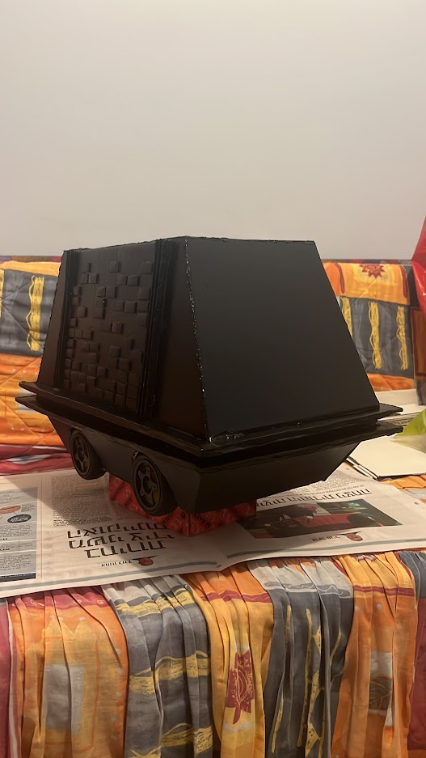
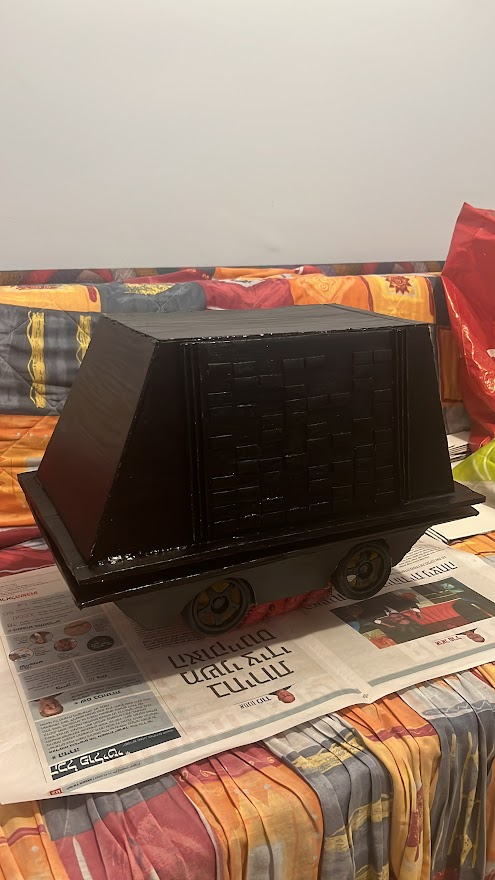
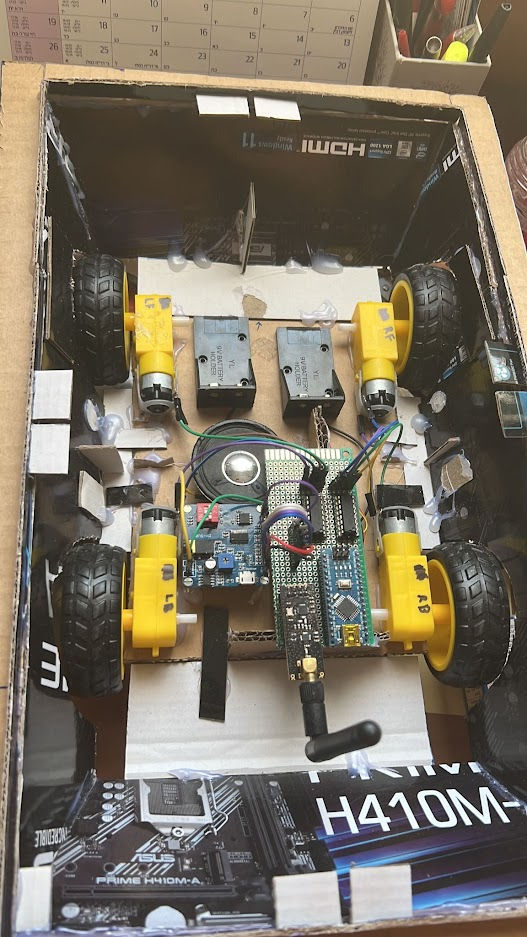

# MSE-6-series repair droid
Builiding replica of MSE-6 Mouse Droid from Star Wars for fun.

The droid is remote controlled and sounds 4 different sounds in loop.

Last update- 14/09/22.

[Demonstration video](https://youtu.be/epnWr3ba0nw)

### Images of the project

## Technical Description
### Schematic of the project

### Main components:
* 2 Arduino Nano Microcontrollers 
* 4 hobbist DC motors 
* Sound Module DY-SV8F loaded with 4 different sounds in loop
* 2 RF module nrf24l01 

### Electrical Circuit inside Droid

### Remote Control

## Operating Principle
* Power-in order to give power to the droid you'll need two 9V batteries and 1 9V battery for the remote. Then Switch on the remote.

* The remote has 2 joysticks. 
  * The left joystick is for controlng the speed of the motors. 
    * Up Position- NULL
    * Down Position- highest speed
    * Middle Position- no movement
    * Right Position- NULL
    * Left Position- NULL
  * The right joystick is for controling the direction of the Droid.
    * Up Position- forward
    * Down Position- highest speed
    * Middle Position- no movement
    * Right Position- turn right
    * Left Position- turn left
    
* While the Droid is powered the sound module will keep sounding 4 diffrent sounds in loop.

## Authors

[Dan Neytur](https://github.com/DanNeytur)

## Acknowledgments
* [Arduino radio controller - NRF24](http://electronoobs.com/eng_arduino_tut25.php)
* [NRF24 PWM RECEIVER code - 7 channels](http://electronoobs.com/eng_arduino_tut25_code4.php)
* [Wireless Joystick for Arduino Robot Car with nRF24L01+](https://dronebotworkshop.com/nrf24l01-wireless-joystick/)
* [Star Wars MSE-6 Mouse Droid - aka Death Star Toaster Droid](https://www.youtube.com/watch?v=cLqNmMH4hsg&ab_channel=JenniiDigital)

